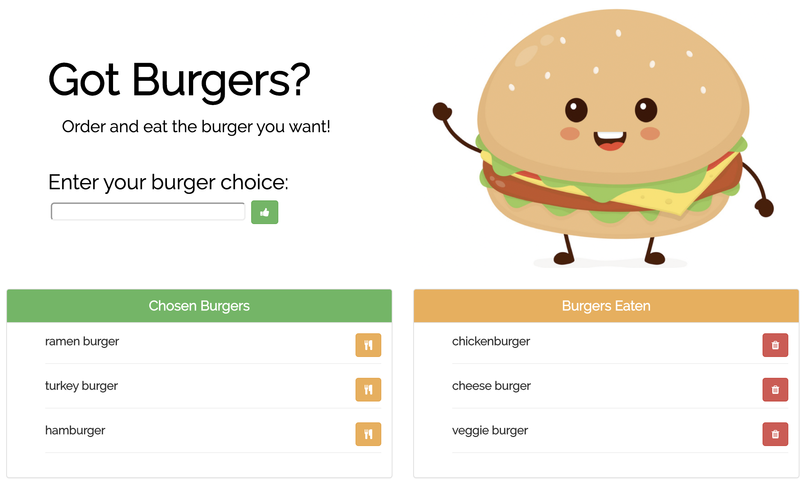

# Node-Express-Handlebars
Node Express Handlebars

## Description

'Got Burgers?' is a restaurant app that lets users input the names of burgers they'd like to eat. This app was built with mySQL, Node, Express, Handlebars and a homemade ORM.

Burgers that have not yet been eaten appear on the left and can be devoured by pushing the devour button. They then move to the right. Burgers can be added in the choose burger box, which updates the mySQL burger database as yet to be devoured.

## GitHub page

My GitHub page can be found here:

//: chriscrichter GitHub [https://github.com/chriscrichter/](https://github.com/chriscrichter/)

